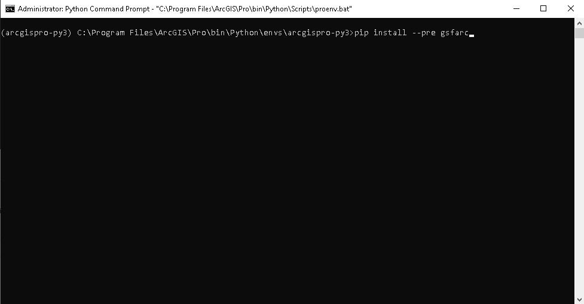

# GSFPy for ArcGIS Pro

## Installation
To install GSFPy for ArcGIS Pro Make sure you have ArcGIS Pro installed and is not running.  First launch the Python Command Prompt as an Administrator from the Windows search button.


Next in the command prompt install gsfarc using pip
```Shell
pip install --pre gsfarc
```



Once gsfarc is install you can verify the installation by launching ArcGIS Pro, opening a project and then selecting analysis -> Tools. In the Geoprocessing Toolboxes pane the GSF toolbox should be available.


## Usage

### Create Toolbox
To create a new toolbox for running GSF Analytics launch the *Create Tool* GPTool in the GSF Toolbox. When the tool is displayed for *Task Endpoint* enter a full URL to a GSF Task you want to wrap as a GPTool. For *Output Toolbox* select a name for the output toolbox. By default the toolbox is created in your project folder.


Once the toolbox is created it needs to be imported into your project. To do this select the Catalog tab, right click on Toolboxes and select *Add Toolbox*.


Navigate to the new toolbox created and open it to your project toolboxes.  From here you can now run the new GPTool in ArcGIS Pro.


