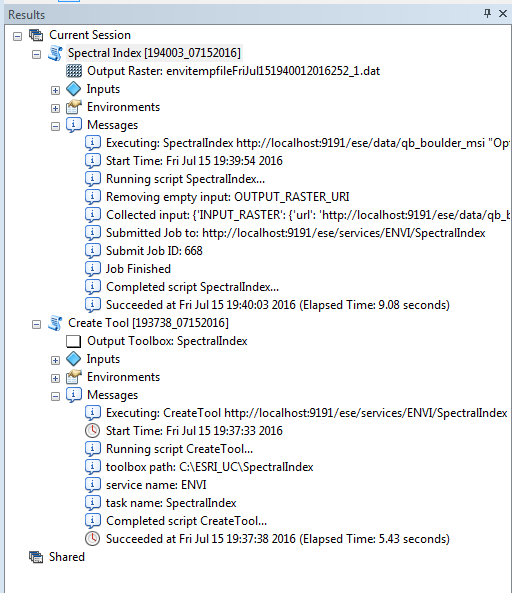

.. _gsfarc:

*****************
GSF Py for ArcGIS
*****************

.. include:: <isonum.txt>

GSF Py for ArcGIS provides a Python client library, named gsfarc, to run IDL and ENVI analytics
provided by Geospatial Services Framework through ArcMap, ArcGIS Pro, and ArcGIS Server.

See http://www.harrisgeospatial.com/ for more details on product offerings.

Usage
=====

GSF Py for ArcGIS allows users to generate an ArcGIS Python Toolbox containing 
geoprocessing tools (GPTools) associated with tasks provided by GSF.

There are three ways to create an ArcGIS Python Toolbox:  

* Through a GSF Python Toolbox provided as a system toolbox from ArcMap or ArcGIS Pro.
* Through a command-line tool, named creategptoolbox, provided in the Python scripts directory.
* Through Python using the Python package, gsfarc.

GSF Python Toolbox
==================

From ArcMap
-----------

Once the Python package is installed, the GSF Python toolbox becomes available as a system toolbox.

* Launch ArcMap
* Navigate in the Catalog window to Toolboxes |rarr| System Toolboxes |rarr| GSF.pyt |rarr| Create Tool.  Note: If GSF.pyt does not appear in System Toolboxes, connect to the folder located at C:\\Python27\\ArcGIS10.x\\Lib\\site-packages\\gsfarc\\esri\\toolboxes\\ and GSF.pyt can be run from there.
* Double-click on Create Tool, and the tool appears with two required input parameters.
* The first parameter specifies the REST URL endpoint to the GSF task to be wrapped in a GPTool. The second parameter is the location where the toolbox is created. Note: If not running ArcMap on same system as the GSF server, replace `localhost` with the GSF server name.

* Click OK, and when the tool finishes generating the new toolbox, navigate to the location specified in Output Toolbox. 
* Double-click on Spectral Index, and the tool appears with two required input parameters and one optional parameter. 

* There are two options available for selecting data for the Input Raster.  The first option is to select a raster from a directory. For this option to succeed, the data must be accessible by the GSF Server as well - either on the server itself, or on a shared network drive that can be accessed by GSF.  The second option is to input an http data source that GSF can handle.  By default, a GSF server has sample data available at the http://localhost:9191/ese/data location. To test the tool generation, choose the http option.

* Click OK, and when the tool finishes processing, the result appears in ArcGIS.  Debug Tip: To see if GSF server received the job and to check the job status, go to http://localhost:9191/job-console/

From ArcGIS Pro
---------------

Once the Python package is installed, the GSF Python toolbox can be added to a project in ArcGIS Pro. 

* Launch ArcGIS Pro
* Select or create new project to work with GSF Tasks
* To setup for the display of results, select the Insert tab and click on New Map
* In Project pane, select Toolboxes, right-click and select Add Toolbox
* Navigate to C:\\Python34\\Lib\\site-packages\\gsfarc\\esri\\toolboxes, and select GSF.pyt
* Expand the GSF toolbox, and double-click on Create Tool.
* The tool appears with two required input parameters. The first parameter specifies the REST URL endpoint to the GSF task to be wrapped in a GPTool. The second parameter is the location where the toolbox is created. Note: If not running ArcGIS Pro on same system as the GSF server, replace `localhost` with the GSF server name.

* Click run and when the tool finishes generating a new toolbox, navigate in the Project tab to the location specified in Output Toolbox. 
* Double-click on Spectral Index. The tool will appear with two required parameters, and one optional parameter. 

* There are two options available for selecting an image for Input Raster.  The first option is to select a raster from a directory. For this option to succeed, the data must be also accessible by the GSF Server - either on the server itself, or on a shared network drive that can be accessed by GSF.  The second option is to use an http data source that GSF can handle.  By default, a GSF server has sample data available at the http://localhost:9191/ese/data location. To test the tool generation, choose the http option.

* Click OK, and when the tool finishes processing, the result will appear in ArcPro.  Debug Tip: To see if GSF server received the job and to check the job status, go to http://localhost:9191/job-console/

Publish to ArcGIS Server
------------------------

To publish a GPTool to ArcGIS Server, install GSF Py on ArcGIS Server, 
selecting the GSF Py 64-bit option. After the installation of GSF Py on the ArcGIS Server, 
restart the ArcGIS Server to make GSF Py client Python libraries available
to GPServices. 
Note: The ArcGIS Server publishing tools are only available in ArcMap.
 
If the ArcGIS Server is not on the same host as the GSF Server, enter the GSF server name instead of localhost when creating the tool. See instructions above to generate and run a tool.

* After a GPTool has completed execution, select Geoprocessing |rarr| Results.
* In the Current Session there are two results, one for Create Tool, and the other for Spectral Index.

* Right-click on the Spectral Index result, and select Share As |rarr| Geoprocessing Service.
* Follow ESRI instructions on how to publish a service.

From Command-line
=================

creategsftoolbox.py is a command-line tool in the gsfarc package used to create a Python toolbox that wraps GSF tasks.

For ArcMap the script is located at C:\\Python27\\ArcGIS10.x\\scripts.

For ArcGIS Pro the script is located at C:\\Python34\\scripts.

To display the help, navigate to the scripts directory and run the --help option::

    $ creategsftoolbox.py --help

To create a Python toolbox with the ENVI Tasks SpectralIndex and ISODATAClassification, run this command.  If not running on the same system as the server, replace localhost with server name.::

    $ creategsftoolbox.py http://localhost:9191/ese/services/ENVI SpectralIndex ISODATAClassification --output C:\\ENVITasks.pyt

The toolbox name is the same as the service name if no option is provided.
The output directory defaults to the current directory if no option is provided.

From Python
===========

The create_toolbox member method is the first way to create a toolbox from a Python module.  Connect to the GSF server the toolbox is intended to use.  If not running on the same system as the server, replace localhost with server name.::

    >>> from gsf import Server
    >>> server = Server('localhost','9191')

Now, construct a list of tasks to add to the toolbox::

    >>> service = server.service('ENVI')
    >>> task_list = [service.task('SpectralIndex'), service.task('ISODATAClassification')]

Next, instantiate a GPToolbox class for creating a toolbox::

    >>> from gsfarc.gptoolbox import GPToolbox
    >>> gsf_toolbox = GPToolbox(task_list)
    >>> toolbox_file = gsf_toolbox.create_toolbox('c:\\my_gsf_tools')

The create_toolbox method returns the filename of the toolbox, which can then be used by arcpy to import the toolbox::

    >>> import arcpy
    >>> arcpy.ImportToolbox(toolbox_file)
	
Run the toolbox.

    >>> input_raster = 'http://localhost:9191/ese/data/qb_boulder_msi'
    >>> index = 'Normalized Difference Vegetation Index'
    >>> result = arcpy.GSF.SpectralIndex(input_raster,index)
    >>> print(result)

API Documentation
=================

.. toctree::
   :maxdepth: 2

   api
